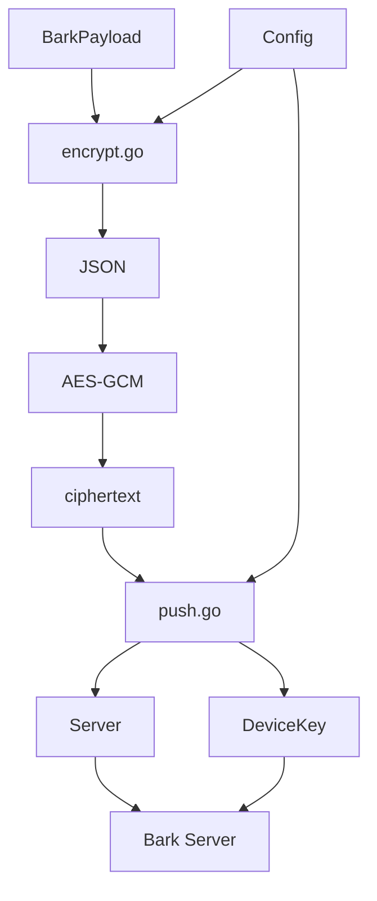

# Bark AES-256-GCM Encryption Flow
加密过程



# 函数

```mermaid
flowchart TD

    A[BarkPayload]

    A --> B[encrypt()]

    B --> C[json.Marshal()]
    
    C --> D[JSON []byte]

    D --> E[aesGCMEncrypt()]

    F[LoadConfig()<br/>BARK_AES_KEY]
    G[LoadConfig()<br/>BARK_AES_IV]

    F --> E
    G --> E

    E --> H[ciphertext []byte]

    H --> I[encodeCiphertext()]

    I --> J[Base64.StdEncoding]

    J --> K[url.QueryEscape]

    K --> L[最终字符串]
```